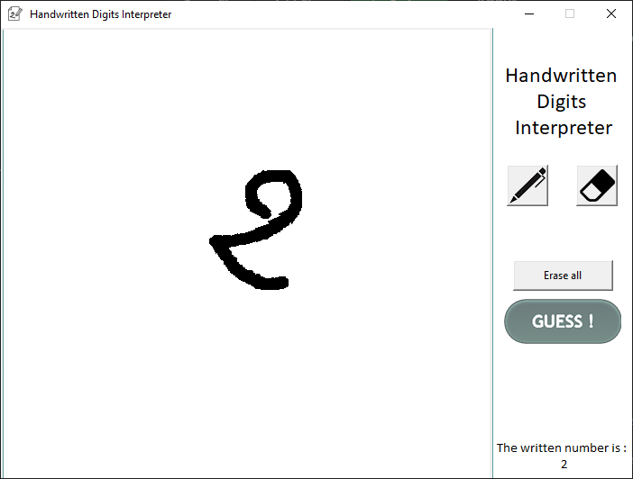

# Handwriting_interpreter

Handwritten numbers recognition system using a backpropagation neural network trained using the MNIST dataset.

The steps followed in implementing the system are :

- Pre-processing the dataset
- Feature extraction using a method called LLF (Local Line Fitting) which is based on geometric ans statistic properties of the handwritten numbers
- Training the recognition model and storing it for future use

With some tinkering in the model hyper-parameters we managed to reach a precision of 92% using only a simple neural network!

